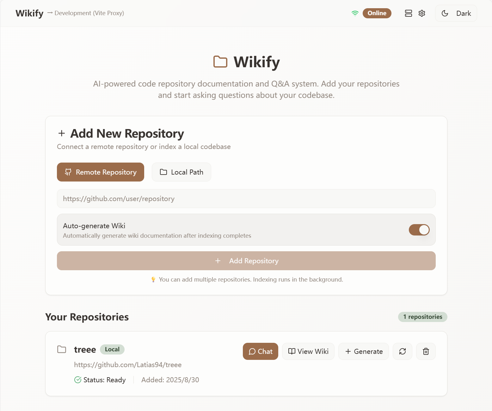
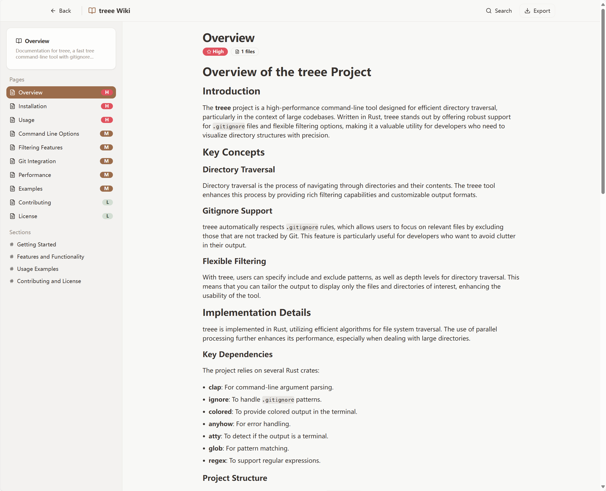
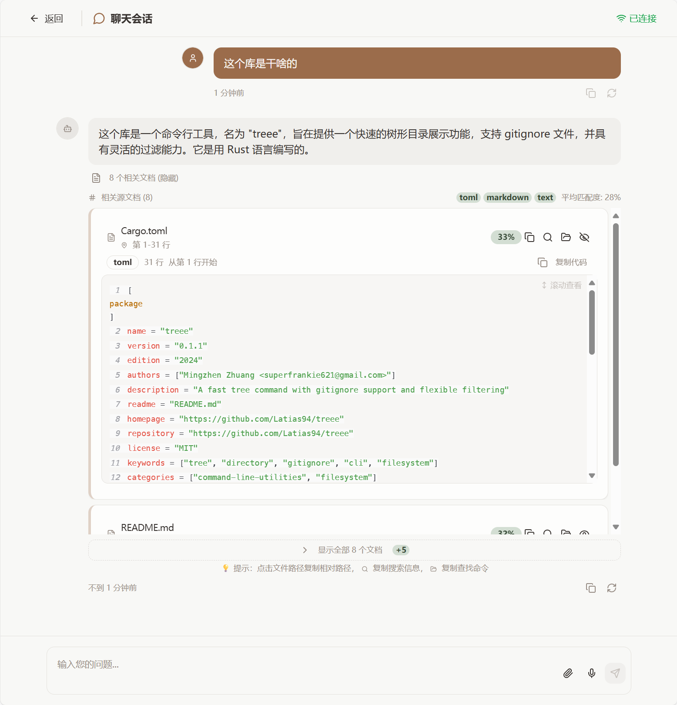

# Wikify

[](LICENSE)
[](https://www.rust-lang.org)

**Wikify** is a self-hosted, open-source tool that automatically generates comprehensive wikis for code repositories using advanced RAG (Retrieval-Augmented Generation) technology.

Transform any codebase into intelligent, searchable documentation with AI-powered analysis and Q&A capabilities.

## � Screenshots

### Repository Management

*Add and manage repositories, track indexing progress, and generate wikis*

### Generated Wiki

*Structured, searchable documentation with hierarchical navigation*

### Interactive Chat

*Ask questions about your codebase and get intelligent answers*

## �🚀 Quick Start

### Prerequisites
- Rust 1.70+
- Node.js 18+ (for web interface)
- LLM API key (OpenAI, Anthropic, Google, or local Ollama)

### Installation

1. **Clone the repository**
   ```bash
   git clone https://github.com/Latias94/wikify.git
   cd wikify
   ```

2. **Set up environment**
   ```bash
   # Copy environment template
   cp .env.example .env

   # Edit .env with your LLM API keys
   # OPENAI_API_KEY=your_openai_key
   # ANTHROPIC_API_KEY=your_anthropic_key
   ```

3. **Deploy Wikify**

   **Option A: Docker (Recommended)**
   ```bash
   # One-command deployment
   ./scripts/deploy.sh
   # or on Windows: .\scripts\deploy.ps1
   ```

   **Option B: Native Development**
   ```bash
   cd wikify-web
   cargo run --release
   ```

4. **Launch the web interface**
   ```bash
   cd web
   npm install
   npm run dev
   ```

5. **Open your browser** to `http://localhost:5173`

## ✨ Features

- **📚 Automatic Wiki Generation**: Transform any repository into structured documentation
- **🔍 Intelligent Q&A**: Ask questions about your codebase and get accurate answers
- **🌐 Multi-Platform**: Support for GitHub, GitLab, and local repositories
- **🤖 Multi-LLM Support**: OpenAI, Anthropic, Google, Ollama integration
- **⚡ Real-time Processing**: Streaming responses and live progress updates
- **📝 Markdown Export**: Beautiful, readable documentation output

## 🏗️ Architecture

Wikify is built with a modular Rust workspace architecture:

```text
wikify/
├── wikify-core/          # Core data structures and traits
├── wikify-indexing/      # Document indexing using cheungfun
├── wikify-rag/           # RAG system implementation
├── wikify-wiki/          # Wiki generation engine
├── wikify-cli/           # Command-line application
├── wikify-web/           # Web server application
└── web/                  # React frontend
```

**Two deployment options:**
- **🔧 CLI Tool**: Developer-focused command-line interface
- **🌐 Web Interface**: User-friendly web application with React frontend

## � Usage

### Web Interface (Recommended)

1. **Add a repository** - GitHub URL or local path
2. **Wait for indexing** - Automatic processing and vectorization
3. **Generate wiki** - Click "Generate Wiki" for comprehensive documentation
4. **Ask questions** - Use the chat interface for intelligent Q&A

### Command Line Interface

```bash
# Generate wiki for a repository
cargo run --bin wikify -- wiki ./my-repo --output ./docs

# Ask questions about your codebase
cargo run --bin wikify -- ask "How does authentication work?"
```

## ⚙️ Configuration

Set your LLM API keys in `.env`:

```bash
# OpenAI
OPENAI_API_KEY=your_openai_key

# Anthropic
ANTHROPIC_API_KEY=your_anthropic_key

# Google
GOOGLE_API_KEY=your_google_key

# Or use local Ollama (no API key needed)
OLLAMA_BASE_URL=http://localhost:11434
```

## �️ Tech Stack

- **Backend**: Rust with Axum web framework
- **Frontend**: React + TypeScript + Vite
- **RAG Framework**: [cheungfun](https://github.com/YumchaLabs/cheungfun) for document processing and vector search
- **LLM Integration**: [siumai](https://crates.io/crates/siumai) for unified LLM API access
- **Vector Storage**: FAISS for high-performance similarity search
- **UI Components**: shadcn/ui with Tailwind CSS

## 🤝 Contributing

We welcome contributions! Please feel free to submit issues, feature requests, or pull requests.

## 🏗️ Architecture

Wikify follows a modern, modular architecture designed for performance and scalability:

### 🧩 **Core Components**

```
┌─────────────────┐    ┌─────────────────┐    ┌─────────────────┐
│   wikify-web    │    │ wikify-applications │    │  wikify-rag     │
│  (Axum Server)  │◄──►│  (Business Logic)   │◄──►│  (RAG Engine)   │
└─────────────────┘    └─────────────────┘    └─────────────────┘
         │                       │                       │
         ▼                       ▼                       ▼
┌─────────────────┐    ┌─────────────────┐    ┌─────────────────┐
│   React SPA     │    │  wikify-core    │    │ wikify-indexing │
│  (Frontend UI)  │    │ (Shared Types)  │    │ (Code Analysis) │
└─────────────────┘    └─────────────────┘    └─────────────────┘
```

### 🚀 **Key Features**

- **🧠 Adaptive Research Engine**: Intelligent strategy selection based on question type
- **⚡ High Performance**: Rust-powered backend with zero-cost abstractions
- **🔄 Real-time Updates**: WebSocket-based live research progress
- **🛡️ Type Safety**: Comprehensive type system prevents runtime errors
- **📦 Modular Design**: Clean separation of concerns and easy extensibility

## ⚙️ Configuration

Wikify uses a comprehensive TOML-based configuration system. Key configuration files:

- **`config/wikify.toml`**: Main configuration file
- **`.env`**: Environment variables (copy from `.env.example`)
- **`docker-compose.yml`**: Container orchestration

### 📋 **Configuration Sections**

| Section | Purpose | Key Settings |
|---------|---------|--------------|
| `[server]` | Web server settings | host, port, dev_mode |
| `[llm]` | LLM provider config | provider, models, api_keys |
| `[rag]` | RAG system settings | embedding_model, chunk_size |
| `[research]` | Research engine | max_iterations, strategies |
| `[permissions]` | Access control | mode (open/private/enterprise) |

### 🔧 **Environment Variables**

```bash
# LLM Configuration
OPENAI_API_KEY=your-openai-key
ANTHROPIC_API_KEY=your-anthropic-key

# Server Configuration
WIKIFY_HOST=127.0.0.1
WIKIFY_PORT=8080
WIKIFY_PERMISSION_MODE=open

# Development
RUST_LOG=info
WIKIFY_DEV_MODE=true
```

## 🐳 Docker Deployment

### **Quick Start with Docker**

```bash
# Clone and deploy
git clone https://github.com/your-org/wikify.git
cd wikify
cp .env.example .env
# Edit .env with your API keys
docker-compose up -d
```

### **Docker Services**

- **wikify**: Main application container
- **volumes**: Persistent data storage
- **networks**: Isolated container networking

### **Health Monitoring**

```bash
# Check service health
docker-compose ps
docker-compose logs wikify

# Access health endpoint
curl http://localhost:8080/api/health
```

## 🔧 Development

### **Development Setup**

```bash
# Install dependencies
cargo check --workspace
cd web && npm install && cd ..

# Run in development mode
cargo run --bin wikify-web
# In another terminal:
cd web && npm run dev
```

### **Testing**

```bash
# Run all tests
cargo test --workspace

# Run specific test suites
cargo test -p wikify-applications
cargo test -p wikify-rag

# Run with output
cargo test -- --nocapture
```

### **Code Quality**

```bash
# Format code
cargo fmt --all

# Lint code
cargo clippy --workspace --all-targets

# Check for unused dependencies
cargo machete
```

## 📄 License

This project is licensed under either of:

- Apache License, Version 2.0 ([LICENSE-APACHE](LICENSE-APACHE))
- MIT License ([LICENSE-MIT](LICENSE-MIT))

at your option.

## � Acknowledgments

Special thanks to the amazing open-source projects that make Wikify possible:

- **[DeepWiki](https://github.com/AsyncFuncAI/deepwiki-open)** - The original inspiration for this project
- **[cheungfun](https://github.com/YumchaLabs/cheungfun)** - Powerful RAG framework for document processing
- **[siumai](https://crates.io/crates/siumai)** - Unified LLM API integration
- **Rust Community** - For the incredible ecosystem and tools

---

**Built with ❤️ in Rust for the developer community**
